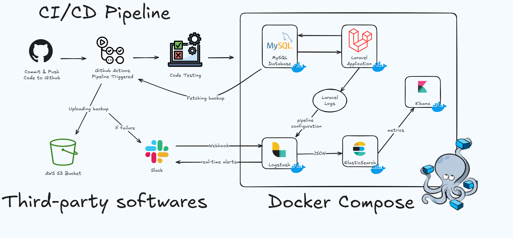

# ELK-Stack-with-Laravel

A comprehensive Laravel application deployment setup with Docker, ELK Stack (Elasticsearch, Logstash, Kibana), Slack notifications, and automated backups to AWS S3.



## 🚀 Features

- PHP 8.2 with Apache
- MySQL 8.0 Database
- ELK Stack integration for centralized logging
- Slack notifications for real-time alerts
- Automated CI/CD with GitHub Actions
- Automated database backups to AWS S3
- Custom Apache configuration
- Optimized PHP settings
- Automatic database migration on startup
- Wait-for-it script to ensure proper service startup order

## 📋 Prerequisites

- Docker and Docker Compose installed
- AWS Account with S3 access
- Slack Workspace with API access
- Git (optional, for cloning the repository)

## 🏗️ Project Structure

```bash
├── apache/
│   └── 000-default.conf
├── logstash/
│   │   └── pipeline/
│   │       └── laravel.conf
├── php/
│   └── php.ini
├── src/
│   └── [Laravel Project Files]
├── .github/
│   └── workflows/
│       ├── ci-cd.yml
│       └── backup.yml
├── Dockerfile
├── docker-compose.yml
└── wait-for-it.sh
```

## 🔧 Configuration

### Docker Environment Variables

Change the following environment variables in your `docker-compose.yml` file:

```yaml
# Laravel & MySQL
DB_CONNECTION=mysql
DB_HOST=mysql
DB_PORT=3306
DB_DATABASE=laravel_db
DB_USERNAME=root
DB_PASSWORD=root_password
```

### GitHub Secrets Configuration

Sensitive data such as AWS credentials and Slack webhook URLs should be stored securely as GitHub Secrets. To configure these:

1. Navigate to your GitHub repository and go to Settings → Secrets and variables → Actions.

2. Add the following secrets:

- `AWS_ACCESS_KEY_ID`: Your AWS Access Key.
- `AWS_SECRET_ACCESS_KEY`: Your AWS Secret Key.
- `AWS_DEFAULT_REGION`: The AWS region of your S3 bucket (e.g., us-east-1).
- `AWS_BUCKET`: The name of your S3 bucket.
- `SLACK_WEBHOOK_URL`: The URL for sending Slack notifications.

### Example Workflow Reference

Secrets are referenced directly in the GitHub Actions workflow like so:

```yaml
env:
  AWS_ACCESS_KEY_ID: ${{ secrets.AWS_ACCESS_KEY_ID }}
  AWS_SECRET_ACCESS_KEY: ${{ secrets.AWS_SECRET_ACCESS_KEY }}
  AWS_DEFAULT_REGION: ${{ secrets.AWS_DEFAULT_REGION }}
  AWS_BUCKET: ${{ secrets.AWS_BUCKET }}
  SLACK_WEBHOOK_URL: ${{ secrets.SLACK_WEBHOOK_URL }}
```

## 🚀 Getting Started

### Clone repository:

```bash
git clone https://github.com/anas1412/ELK-Stack-with-Laravel.git
cd ELK-Stack-with-Laravel
```

### Add your project:

```bash
cd src
rm -rf add-your-laravel-project-here && git clone [your-project-url]
```

OR if you want to test it out on a new laravel project before:

```bash
cd src
rm -rf add-your-laravel-project-here && composer create-project laravel/laravel .
```

### Start the stack:

```bash
cd ..
docker-compose up -d --build
```

### Access your services:

- Laravel Application: http://localhost:8080
- Kibana Dashboard: http://localhost:5601
- Elasticsearch: http://localhost:9200

## 📦 Container Details

### ELK Stack Configuration

Elasticsearch

```yaml
cluster.name: "docker-cluster"
network.host: 0.0.0.0
discovery.type: single-node
xpack.security.enabled: true
```

Logstash Pipeline Configuration

```conf
input {
  file {
    type => "laravel-logs"
    path => "/var/www/html/storage/logs/laravel*.log"
    start_position => "beginning"
    sincedb_path => "/dev/null"
    codec => json
  }
}

filter {
  json {
    source => "message"
  }
}

output {
  elasticsearch {
    hosts => ["elasticsearch:9200"]
    user => "elastic"
    password => "${ELASTIC_PASSWORD}"
    index => "laravel-logs-%{+YYYY.MM.dd}"
  }

  slack {
    url => "${SLACK_WEBHOOK_URL}"
    channel => "#alerts"
    username => "ELK Alert Bot"
    when => [
      "[log_level]" == "error"
    ]
  }
}
```

### Automated Backups Configuration

GitHub Action Workflow (backup.yml)

```yaml
name: Database Backup

on:
  schedule:
    - cron: "0 0 * * *" # Daily at midnight

jobs:
  backup:
    runs-on: ubuntu-latest
    steps:
      - name: Backup Database
        run: |
          mysqldump -h ${{ secrets.DB_HOST }} \
                   -u ${{ secrets.DB_USERNAME }} \
                   -p${{ secrets.DB_PASSWORD }} \
                   ${{ secrets.DB_DATABASE }} > backup.sql

      - name: Upload to S3
        uses: aws-actions/aws-cli@v2
        with:
          args: s3 cp backup.sql s3://${{ secrets.AWS_BUCKET }}/backups/$(date +%Y-%m-%d)-backup.sql
```

## 📊 Monitoring & Alerts

### Kibana Dashboards

Log Monitoring Dashboard:

- Error Rate Overview
- Response Time Distribution
- HTTP Status Code Distribution
- Top Error Messages

Performance Dashboard:

- System Resource Usage
- Database Query Performance
- Cache Hit Rates
- API Endpoint Performance

### Slack Alerts Configuration

Alerts are triggered for:

- Error logs
- High response time (>5s)
- Failed database backups
- System resource thresholds
- Security incidents

## 🔄 CI/CD Pipeline

### GitHub Actions Workflow (ci-cd.yml)

```yaml
name: Laravel CI/CD

on:
  push:
    branches: [main]

jobs:
  build-and-deploy:
    runs-on: ubuntu-latest
    steps:
      - uses: actions/checkout@v2

      - name: Build Docker Images
        run: docker-compose build

      - name: Run Tests
        run: docker-compose run app php artisan test

      - name: Deploy
        if: success()
        run: |
          docker-compose up -d
          docker-compose exec app php artisan migrate --force
```

## 🛟 Troubleshooting

### Common Issues

ELK Stack Connection Issues:

```bash
# Check Elasticsearch status
curl -XGET 'localhost:9200/_cluster/health?pretty'

# Check Logstash pipeline
docker logs elk-logstash

# Verify Kibana connection
docker logs elk-kibana
```

Backup Issues:

```bash
# Check AWS credentials
aws s3 ls s3://your-bucket
```

Log Collection Issues:

```bash
# Restart Logstash
docker-compose restart logstash

# Check Logstash configuration
docker-compose exec logstash logstash --config.test_and_exit
```

## 📈 Performance Optimization

### Elasticsearch Optimization:

```yaml
indices.memory.index_buffer_size: 30%
bootstrap.memory_lock: true
```

### Logstash Performance:

```yaml
pipeline.workers: 2
pipeline.batch.size: 125
pipeline.batch.delay: 50
```

## 📄 License

## 🤝 Contributing
