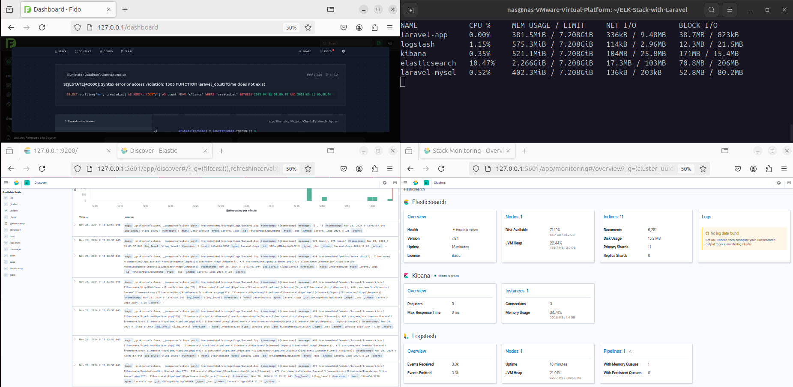

# ELK Stack with Laravel and AWS S3 Backup

<div align="center">
    
    
    
</div>

A comprehensive Laravel application deployment setup integrating Docker, ELK Stack (Elasticsearch, Logstash, Kibana), with advanced logging, monitoring, and automated DevOps features.
Check [ELK-Stack-with-Laravel on github](https://github.com/anas1412/ELK-Stack-with-Laravel) for more information.

## 🖼️ Architecture Mockup




## 🚀 Features

- PHP 8.2 with Apache
- MySQL 8.0 Database
- ELK Stack integration for centralized logging
- Slack notifications for real-time alerts
- Automated CI/CD with GitHub Actions
- Automated database backups to AWS S3
- Custom Apache configuration
- Optimized PHP settings
- Automatic database migration on startup
- Wait-for-it script to ensure proper service startup order

## 📋 Prerequisites

- Git, Docker and Docker Compose installed
- AWS Account with S3 access
- Slack Workspace with API access (optional for slack alerts)

## 🏗️ Project Structure

```bash
├── .github/
│   └── workflows/
│       ├── backup.yml
│       └── ci-cd.yml
├── apache/
│   └── 000-default.conf
├── elasticsearch/
│   └── elasticsearch.yml
├── kibana/
│   └── kibana.yml
├── logstash/
│   │   └── config/
│   │       └── logstash.yml
│   │   └── pipeline/
│   │       └── laravel.conf
├── php/
│   └── php.ini
├── src/
│   └── [Laravel Project Files]
├── Dockerfile
├── docker-compose.yml
└── wait-for-it.sh
```

## 🔧 Configuration

### Docker Environment Variables

Change the following environment variables in your `docker-compose.yml` file:

```yaml
# Laravel & MySQL
DB_CONNECTION=mysql
DB_HOST=mysql
DB_PORT=3306
DB_DATABASE=laravel_db
DB_USERNAME=root
DB_PASSWORD=root_password
```

### GitHub Secrets Configuration

Sensitive data such as AWS credentials and Slack webhook URLs should be stored securely as GitHub Secrets. To configure these:

1. Navigate to your GitHub repository and go to Settings → Secrets and variables → Actions.

2. Add the following secrets:

- `AWS_ACCESS_KEY_ID`: Your AWS Access Key.
- `AWS_SECRET_ACCESS_KEY`: Your AWS Secret Key.
- `AWS_DEFAULT_REGION`: The AWS region of your S3 bucket (e.g., us-east-1).
- `AWS_BUCKET`: The name of your S3 bucket.
- `SLACK_WEBHOOK_URL`: The URL for sending Slack notifications.

### Example Workflow Reference

Secrets are referenced directly in the GitHub Actions workflow like so:

```yaml
env:
  AWS_ACCESS_KEY_ID: ${{ secrets.AWS_ACCESS_KEY_ID }}
  AWS_SECRET_ACCESS_KEY: ${{ secrets.AWS_SECRET_ACCESS_KEY }}
  AWS_DEFAULT_REGION: ${{ secrets.AWS_DEFAULT_REGION }}
  AWS_BUCKET: ${{ secrets.AWS_BUCKET }}
  SLACK_WEBHOOK_URL: ${{ secrets.SLACK_WEBHOOK_URL }}
```

## 🚀 Getting Started

### Clone repository:

```bash
git clone https://github.com/anas1412/ELK-Stack-with-Laravel.git
cd ELK-Stack-with-Laravel
```

### Add a laravel project:

OPTION 1: Add your own project and renaume it to `src/`. Ensure the project is properly configured and accessible.

```bash
git clone [your-project-url]
mv [your-project-name] /src
```

OPTION 2: add your files if they already exist:

```bash
mv /path/to/your/laravel/project src/
```

OPTION 3: if you want to test it out on a new laravel project before moving forward:

```bash
composer create-project laravel/laravel src
```

N.B:

- Don't forget to change `DB_DATABASE` etc .. in `docker-compose.yml` to match your new project's database name.
- Don't forget to make changes to Github Secrets to match your new project's credentials.
- Don't forget to make changes to Github Action workflows to match your project's credentials.
- Don't forget to make changes to `php.ini` & `000-default.conf` to match your new project's requirements.

### Start the stack:

```bash
docker-compose up -d --build
```

### Access your services:

- Laravel Application: http://localhost
- Kibana Dashboard: http://localhost:5601
- Elasticsearch: http://localhost:9200

## 📦 Container Details

### ELK Stack Configuration

Elasticsearch

```yaml
cluster.name: "elasticsearch"
network.host: localhost
```

Kibana

```yaml
server.name: kibana
server.host: "0.0.0.0"
elasticsearch.hosts: ["http://elasticsearch:9200"]
monitoring.ui.container.elasticsearch.enabled: true
```

Logstash

```yaml
xpack.monitoring.enabled: true
xpack.monitoring.elasticsearch.hosts: ["http://elasticsearch:9200"]
http.host: 0.0.0.0
path.logs: /var/log/logstash
log.level: debug
```

Logstash Pipeline Configuration

```conf
input {
  file {
    type => "laravel-logs"
    path => "/var/www/html/storage/logs/laravel.log"
    start_position => "beginning"
    sincedb_path => "/dev/null"
    codec => plain { charset => "UTF-8" }
  }
}

filter {
  grok {
    match => { "message" => "%{TIMESTAMP_ISO8601:timestamp} %{LOGLEVEL:log_level}  %{GREEDYDATA:message}" }
  }
  mutate {
    add_field => {
      "timestamp" => "%{timestamp}"
      "log_level" => "%{log_level}"
      "message" => "%{message}"
    }
  }
  json {
    source => "message"
    target => "json_message"
  }
}

output {
  elasticsearch {
    hosts => ["http://elasticsearch:9200"]
    index => "laravel-logs-%{+YYYY.MM.dd}"
    index_settings => {
      "number_of_replicas" => 0  # Disable replicas for this index
    }
  }
  # Optional: Output to stdout for debugging purposes
  stdout {
    codec => rubydebug
  }
  slack {
    url => "${SLACK_WEBHOOK_URL}"
    channel => "#alerts"
    username => "ELK Alert Bot"
    when => [
      "[log_level]" == "error"
    ]
  }
}
```

### Automated Backups Configuration

GitHub Action Workflow (backup.yml)

```yaml
name: Database Backup

on:
  schedule:
    - cron: "0 0 * * *" # Daily at midnight
  workflow_dispatch: # Allows manual triggering of the workflow

jobs:
  backup:
    runs-on: ubuntu-latest

    steps:
      - name: Checkout Code
        uses: actions/checkout@v4

      - name: Backup Database
        run: |
          TIMESTAMP=$(date +%Y-%m-%d_%H-%M-%S)
          BACKUP_FILE="backup-$TIMESTAMP.sql"
          mysqldump -h ${{ secrets.DB_HOST }} \
                    -P ${{ secrets.DB_PORT }} \
                    -u ${{ secrets.DB_USERNAME }} \
                    -p${{ secrets.DB_PASSWORD }} \
                    ${{ secrets.DB_DATABASE }} > $BACKUP_FILE
          echo "Backup created: $BACKUP_FILE"

      - name: Upload to S3
        uses: aws-actions/aws-cli@v2
        with:
          args: s3 cp $BACKUP_FILE s3://${{ secrets.AWS_BUCKET }}/backups/$BACKUP_FILE
        env:
          AWS_ACCESS_KEY_ID: ${{ secrets.AWS_ACCESS_KEY_ID }}
          AWS_SECRET_ACCESS_KEY: ${{ secrets.AWS_SECRET_ACCESS_KEY }}
          AWS_DEFAULT_REGION: ${{ secrets.AWS_DEFAULT_REGION }}

      - name: Cleanup
        run: |
          rm -f $BACKUP_FILE
          echo "Local backup file deleted."

  notify-failure:
    runs-on: ubuntu-latest
    if: failure() # Only run this job if the backup job fails
    steps:
      - name: Notify on Failure via Slack Webhook
        run: |
          curl -X POST -H 'Content-type: application/json' \
          --data '{"text":"❌ *Database Backup Failed!*\n- Repository: '${{ github.repository }}'\n- Workflow: '${{ github.workflow }}'\n- Job: '${{ github.job }}'\n- Time: '${{ github.event.date }}'"}' \
          ${{ secrets.SLACK_WEBHOOK_URL }}
```

## 🔒 Secrets to Configure

| Secret Name             | Description                                              |
| ----------------------- | -------------------------------------------------------- |
| `DB_HOST`               | The host address of your database server.                |
| `DB_PORT`               | The port of your database server (e.g., 3306 for MySQL). |
| `DB_DATABASE`           | The name of the database to back up.                     |
| `DB_USERNAME`           | The username for the database.                           |
| `DB_PASSWORD`           | The password for the database.                           |
| `AWS_BUCKET`            | The name of your S3 bucket where backups will be stored. |
| `AWS_ACCESS_KEY_ID`     | Your AWS Access Key ID.                                  |
| `AWS_SECRET_ACCESS_KEY` | Your AWS Secret Access Key.                              |
| `AWS_DEFAULT_REGION`    | Your AWS region (e.g., `us-east-1`).                     |
| `SLACK_WEBHOOK_URL`     | The Slack Webhook URL for sending notifications.         |

## 📊 Monitoring & Alerts

### Kibana Dashboards

Log Monitoring Dashboard:

- Error Rate Overview
- Response Time Distribution
- HTTP Status Code Distribution
- Top Error Messages

Performance Dashboard:

- System Resource Usage
- Database Query Performance
- Cache Hit Rates
- API Endpoint Performance

### Slack Alerts Configuration

Alerts are triggered for:

- Error logs
- High response time (>5s)
- Failed database backups
- System resource thresholds
- Security incidents

## 🔄 CI/CD Pipeline

### GitHub Actions Workflow (ci-cd.yml)

Here you can configure your CI/CD pipeline to automate the deployment process. This includes building, testing, and deploying your Laravel application. You can customize the workflow to fit your specific needs.

```yaml
name: Laravel CI/CD

on:
  push:
    branches: [main]

jobs:
  build-and-deploy:
    runs-on: ubuntu-latest
    steps:
      # Step 1: Checkout the code
      - name: Checkout Code
        uses: actions/checkout@v2

      # Step 2: Set up Docker and Docker Compose
      - name: Set up Docker Compose
        run: |
          sudo apt-get update
          sudo apt-get install -y docker-compose

      # Step 3: Install Composer
      - name: Install Composer
        run: |
          curl -sS https://getcomposer.org/installer | php
          sudo mv composer.phar /usr/local/bin/composer

      # Optional Step: Download a new Laravel project or change this with your project URL
      - name: Set up a new Laravel project
        run: composer create-project --prefer-dist laravel/laravel src --no-interaction

      # Step 4: Build Docker Images
      - name: Build Docker Images
        run: docker-compose build

      # Step 5: Run Laravel Tests
      - name: Run Tests
        run: docker-compose run app php artisan test

      # Step 6: Deploy the Application
      - name: Deploy
        if: success()
        run: |
          docker-compose up -d
          docker-compose exec --no-TTY app php artisan migrate --force --no-interaction
          echo "Application deployed successfully."
          docker-compose down
```

## 🛟 Troubleshooting

### Common Issues

ELK Stack Connection Issues:

```bash
# Check Elasticsearch status
curl -XGET 'localhost:9200/_cluster/health?pretty'

# Check Logstash pipeline
docker logs elk-logstash

# Verify Kibana connection
docker logs elk-kibana
```

Backup Issues:

```bash
# Check AWS credentials
aws s3 ls s3://your-bucket
```

Log Collection Issues:

```bash
# Check Elasticsearch
curl -XGET 'localhost:9200/_cluster/health?pretty'

# Logstash logs
docker logs logstash

# Laravel application logs
docker-compose exec app tail -f /var/www/html/storage/logs/laravel.log
```

## 📈 Performance Optimization

### Elasticsearch Optimization:

```yaml
indices.memory.index_buffer_size: 30%
bootstrap.memory_lock: true
```

### Logstash Performance:

```yaml
pipeline.workers: 2
pipeline.batch.size: 125
pipeline.batch.delay: 50
```

## 📝 TODO List

### Short-term Improvements

[] Improve the Slack notification configurations in Logstash

[] Implement comprehensive error handling.

[] Enhance Kibana dashboard visualizations

[] Create more detailed logging filters

### Performance Optimization & Security Enhancements

[] Fine-tune Elasticsearch memory settings

[] Implement log rotation strategies

[] Add caching mechanisms

[] Enable Elasticsearch security features

[] Implement SSL/TLS for services

### Monitoring & Observability

[] Integrate application performance monitoring (APM)

[] Create custom Grafana dashboards

[] Set up more advanced alerting rules

### DevOps & Automation

[] Develop rollback strategies

[] Create staging environment configurations

[] Automate dependency updates

[] Implement infrastructure-as-code (IaC)

## 📄 License

This project is licensed under the MIT License. See the [LICENSE](LICENSE) file for more information.

## 🤝 Contributing

Contributions are welcome! Please feel free to open issues or pull requests to help improve this project.
